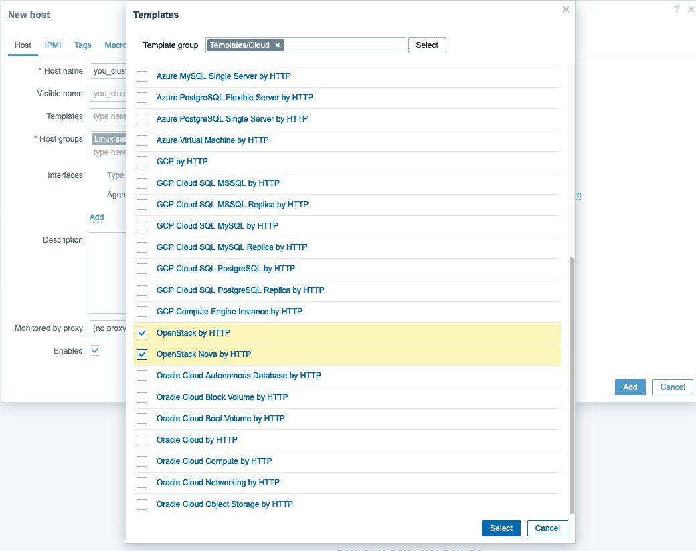
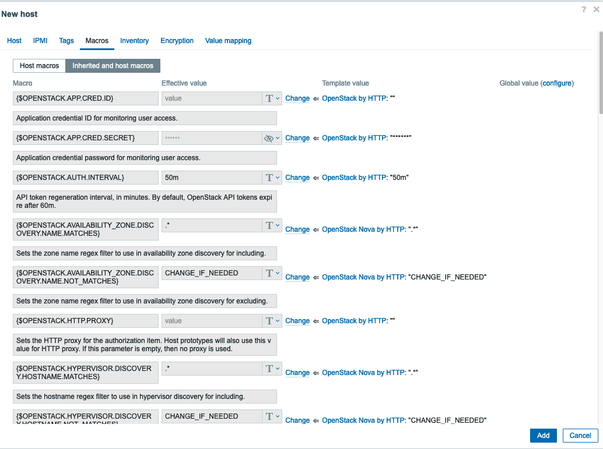

## Zabbix Monitoring

Подготовить пошаговую обезличенную  инструкцию по добавлению и выведению хостов мониторинга Zabbix, добавление метрик. 


## Добавление узла мониторинга zabbix

1. Импорт Zabbix appliance

openstack image create --disk-format qcow2 --file zabbix_appliance-6.4.14.qcow2 zabbix_appliance-6.4.14

2. Создать инстанса из этого appliance

```
openstack server create --image zabbix_appliance-6.4.14\
 --flavor test-flavor\
 --key-name test-keypair\
 --network test-net\
 zabbix-server
```

3. Логин в уставновленный Zabbix

4. Импорт шаблона Openstack

## Настройка кластера openstack и клиента мониторинга

1. Создать проект, пользователя, назначить роль пользователю (для простоты будет роль admin)

```
openstack project create zabbix
openstack user create --project zabbix --password zabbix123 zabbix-monitoring
openstack role add --user zabbix-monitoring --project zabbix admin
```

2. Создать учетные данные для zabbix

```
openstack application credential create --description "Application credential for Zabbix monitoring" zabbix-app
+--------------+----------------------------------------------------------------------------------------+
| Field        | Value                                                                                  |
+--------------+----------------------------------------------------------------------------------------+
| description  | Application credential for Zabbix monitoring                                           |
| expires_at   | None                                                                                   |
| id           | xxx                                                                                    |
| name         | zabbix-app-cred                                                                        |
| project_id   | xxx                                                                                    |
| roles        | member reader admin                                                                    |
| secret       | your-secret-key                                                                        |
| system       | None                                                                                   |
| unrestricted | False                                                                                  |
| user_id      | xxx                                                                                    |
+--------------+----------------------------------------------------------------------------------------+
```

3. Установка агента на хосты контроллеров openstack

```
rpm -Uvh https://repo.zabbix.com/zabbix/6.4/rhel/9/x86_64/zabbix-release-6.4-1.el9.noarch.rpm
dnf install zabbix-agent
```

4. Настройка агнета - добавиь ip адрес сервера мониторнга в конфиг файл

```
cat /etc/zabbix/zabbix_agentd.conf
Server=you_zabbix_server_ip

systemctl start zabbix-agent.service
```
5. Добавить хост openstack cluster в zabbix

 - В дашборде zabbix

   `Monitoring -> Hosts -> Create hosts`
 
 - добавить хост в группу

 - назначиьт хосту шаблоны "Openstack by http", "Openstack Nova by http"
   

 - внести переменные для авторизации в макрос хоста

    ```
    {$OPENSTACK.KEYSTONE.API.ENDPOINT}	
    {$OPENSTACK.APP.CRED.ID}
    {$OPENSTACK.APP.CRED.SECRET}
    ```
 


6. добавление метрик

Необходимо перейти в:

 Data collection → Hosts -> your_host -> Items -> Create item

Отобразится диалог создания элемента данных.
Далее вводим информацию о метрике(элемента данных).

7. Удаление хоста из zabbix

Monitoring -> Host -> your-host -> Configuration -> Delete

8. Удаление хоста мониторинга zabbix

```
openstack server delete  zabbix-server
```


## Описать основные подходы автоматизации.

1. Импорт имиджа и создание сервера выполняется модулями ansible collection - openstack 

```
---

- name: Upload an image from a local file named zabbix_appliance-6.4.14.qcow2
  openstack.cloud.image:
    cloud: openstack
    name: zabbix_appliance-6.4.14
    container_format: bare
    disk_format: qcow2
    state: present
    filename: zabbix_appliance-6.4.14.qcow2

- hosts: localhost
  tasks:
    - name: Create server in an OpenStack cloud
      openstack.cloud.server:
        name: zabbix
        state: present
        cloud: openstack
        region_name: Regone
        image: zabbix_appliance-6.4.14
        flavor_ram: 4096
        boot_from_volume: True
        volume_size: 75
```

2. Импорт шаблона, добавление хоста может быть выполнено модулями ansible collection - zabbix

```
- name: Create a new host or rewrite an existing host's info
  community.zabbix.zabbix_host:
    host_name: ExampleHost
    visible_name: ExampleName
    description: zabbix client
    host_groups:
      - linux
      - application
    link_templates:
      - Openstack by http
      - Openstack Nova by http
    status: enabled
    state: present
    inventory_mode: manual
    inventory_zabbix:
      tag: "{{ your_tag }}"
      alias: "{{ your_alias }}"
      notes: "Special Informations: {{ your_informations | default('None') }}"
      location: "{{ your_location }}"
      site_rack: "{{ your_site_rack }}"
      os: "{{ your_os }}"
      hardware: "{{ your_hardware }}"
    interfaces:
      - type: 1
        main: 1
        useip: 1
        ip: 10.xx.xx.xx
        dns: ""
        port: "10050"
    macros:
      - macro: "{$OPENSTACK.KEYSTONE.API.ENDPOINT}"
        value: http://localhost:5000
      - macro: "{$OPENSTACK.APP.CRED.ID}"
        value: xxx
      - macro: "{$OPENSTACK.APP.CRED.SECRET}"
        value: xxx

```

3. Установка и конфигурирование агнета zabbix выполняется стандартными средствами  ansible

```
---

- name: Installed
  yum:
    name: zabbix-agent
    state: present
  tags:
    - zabbix-agent-install

- name: Configured
  template:
    src: zabbix_agentd.conf.j2
    dest: /etc/zabbix/zabbix_agentd.conf
    mode: '0644'
  notify: Restart zabbix-agent
  tags:
    - zabbix-agent-config

- name: "Service enabled and zabbix-agent"
  systemd:
    name: zabbix-agent
    enabled: true

```
